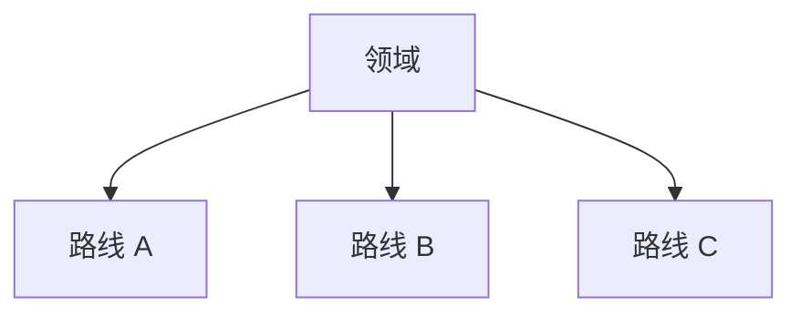

# {{title}} — Review 精读

## 0. 基本信息

- Citekey：{{citekey}}
- 研究主题：{{topic}}
- 类型：Review / Survey

## 1. 这篇综述试图回答什么

## 2. 领域分类体系（Taxonomy）

## 3. 技术路线如何演化

## 4. 各路线重点提取

| 路线 | 核心思想 | 代表工作 | 优点 | 局限 | 定位 |
|---|---|---|---|---|---|

## 5. 常用数据集 / 实验平台 / 评价指标

## 6. 作者明确指出的争议和未解决问题

## 7. 作者提出的未来方向

## 8. 最值得作为入门阅读的章节

| 优先级 | 章节 | 为什么 | 定位 |
|---|---|---|---|

## 9. AI 分析：这篇综述的覆盖范围与偏向

## 10. 主动回忆问题

## 11. 待核验 / 暂无

## 参考来源
